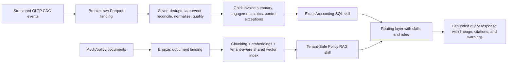

# Caseware AI-Ready Data Platform POC

A small-but-deep reference implementation for a multi-tenant accounting and audit data platform. The project demonstrates CDC-style ingestion, bronze/silver/gold lakehouse layers, exact SQL serving for structured finance questions, tenant-safe RAG for unstructured audit artifacts, agent routing with explicit skills and rules, and production-minded observability.

This repository is intentionally a POC, not a full platform. The goal is to show hands-on depth, clear trade-offs, and disciplined implementation choices in a format suitable for a technical interview walkthrough.

## What It Demonstrates

- Incremental structured ingestion with replayable bronze landing files
- Late-arriving and duplicate event handling in silver transformations
- Curated gold tables for exact financial and operational questions
- Chunking and vector indexing for policies, workpapers, notes, and issue summaries
- Tenant isolation across storage, transforms, retrieval, and serving
- Agent-facing routing that keeps exact numbers in SQL and narrative context in RAG
- Data quality checks, lineage references, and structured JSON observability
- A local implementation with a clear AWS production mapping

## Architecture



## Repo Layout

```text
docs/
  architecture.md
  aws-production-mapping.md
  challenge-coverage.md
  interview-walkthrough.md
  skills-and-rules.md
  terminology-mapping.md
scripts/
  run_demo.py
  serve_api.py
src/caseware_poc/
  common/
  ingestion/
  rag/
  serving/
  transformations/
  app.py
  platform.py
tests/
```

## Quickstart

```bash
python3.11 -m venv .venv
. .venv/bin/activate
pip install -e '.[dev]'
python scripts/run_demo.py
pytest
python scripts/serve_api.py
```

API endpoints:

- `GET /health`
- `POST /bootstrap`
- `POST /query`

Example query payload:

```json
{
  "tenant_id": "tenant_alpha",
  "question": "What is the total invoice amount overdue for tenant alpha this month?"
}
```

## Core Design Choices

- Structured accounting data stays in SQL-backed gold tables. It is never treated as an embedding-first problem.
- Documents are chunked and indexed for semantic retrieval, but tenant filters are applied before scoring.
- Bronze preserves raw payloads plus `payload_json` so silver can evolve independently from JSON schema inference quirks.
- The vector path uses a deterministic local embedding adapter so the repo is runnable without external model or API dependencies.
- Mixed questions trigger a guardrail flow: SQL owns exact values, documents only provide context.

## Demo Questions

- `What is the total invoice amount overdue for tenant alpha this month?`
- `What does tenant alpha's revenue recognition policy say about deferred revenue?`
- `What does the OCR workpaper table say about onboarding services and what exact amount is overdue?`
- `Which controls have exceptions for tenant beta?`
- `What does tenant beta's deferred revenue policy say about implementation fees?`

## Verification

- `pytest` covers routing, chunking, bootstrap, SQL, RAG, and guardrail behavior
- `scripts/run_demo.py` resets the environment, rebuilds the full platform slice, and runs the example questions end to end

## Documentation

- [Architecture](docs/architecture.md)
- [Challenge Coverage](docs/challenge-coverage.md)
- [Skills and Rules](docs/skills-and-rules.md)
- [Terminology Mapping](docs/terminology-mapping.md)
- [AWS Production Mapping](docs/aws-production-mapping.md)
- [Interview Walkthrough](docs/interview-walkthrough.md)
