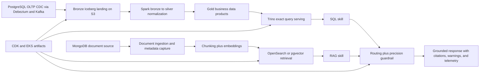

# Caseware AI-Ready Data Platform POC

This repository is a single-document, production-shaped POC for the challenge you want to show Caseware.

The purpose of the repo is not to be fully deployable.

The purpose is to prove hands-on depth by showing concrete code, file structure, architecture decisions, guardrails, ingestion patterns, retrieval design, observability, and infrastructure definitions that look like the kind of system a real AI/data platform team would build.

## What This Is Trying To Prove

This repo is designed to answer the exact concerns from the interview feedback:

- not just broad awareness, but concrete implementation details
- not just “I know RAG,” but chunking, metadata filters, exact-vs-semantic routing, and retrieval guardrails
- not just “I know data platforms,” but CDC, bronze/silver/gold, quality checks, lineage, and replayability
- not just “I know AI systems,” but LangGraph, Bedrock-shaped orchestration, repo-native skills/rules, and observability
- not just “I know AWS,” but CDK, S3, Glue, Lake Formation, EMR Serverless, OpenSearch, EKS, CloudWatch, and production-facing service boundaries

## Challenge Statement

Design and implement a production-style reference solution for a multi-tenant AI-ready accounting and audit data platform that supports:

1. structured operational and financial data requiring exact SQL-style answers
2. unstructured audit and policy documents requiring tenant-safe semantic retrieval
3. explicit routing between structured and unstructured query paths
4. tenant isolation, observability, quality checks, lineage, and architecture trade-offs

## Architecture Summary



## End-To-End Flow

### Structured path

1. A PostgreSQL OLTP source represents invoices, customers, engagements, controls, and other accounting entities.
2. Debezium/Kafka Connect connector configs capture change events and publish them into Kafka topics.
3. Spark jobs model CDC ingestion into bronze Iceberg tables.
4. Bronze preserves raw payloads and `payload_json` for replayability and historical reprocessing.
5. Silver deduplicates events, reconciles late and out-of-order changes, and creates normalized snapshots.
6. Gold creates business-ready products such as invoice summary, engagement status, and control exceptions.
7. Trino represents the exact structured serving layer for governed answers.

### Unstructured path

1. A MongoDB source represents policy documents, workpapers, engagement notes, and issue summaries.
2. Documents carry tenant metadata, classification, retention state, and source URIs.
3. Chunking logic treats narrative text and OCR/table-like text differently.
4. Embeddings are generated and retrieval is modeled for either OpenSearch Serverless or Aurora PostgreSQL with pgvector.
5. Retrieval always applies tenant and retention filters before scoring.
6. Returned answers include citations and warnings when grounding is weak.

### Agent and guardrail path

1. Routing determines whether the question is structured, narrative, or mixed.
2. Exact finance questions must use SQL-backed gold products.
3. Narrative questions use tenant-safe retrieval.
4. Mixed questions trigger the precision guardrail path so exact values still come from SQL and documents are only context.
5. A LangGraph workflow models the production-style multi-step agent orchestration.

## What Has Been Implemented

### Ingestion and source systems

- `docker/compose.yaml`
  Demo stack for PostgreSQL, MongoDB, Kafka, Debezium/Kafka Connect, and OpenSearch.
- `docker/postgres/init/001_caseware_oltp.sql`
  OLTP schema, sample rows, replica identity, and publication for CDC.
- `docker/mongo/init/001_seed_documents.js`
  Seed document records with tenant metadata.
- `docker/connectors/postgres-cdc.json`
  Debezium PostgreSQL connector config.
- `docker/connectors/mongodb-documents.json`
  Debezium MongoDB connector config.
- `src/caseware_poc/integrations/debezium_connect.py`
  Kafka Connect client for registering connectors.
- `src/caseware_poc/integrations/kafka_cdc_consumer.py`
  Kafka CDC microbatch consumer shape.
- `src/caseware_poc/integrations/mongo_document_source.py`
  MongoDB document-source integration.

### Lakehouse and transformation layer

- `jobs/spark/cdc_to_bronze.py`
  Kafka to Iceberg bronze ingestion.
- `jobs/spark/bronze_to_silver.py`
  Deduplication and normalization from bronze to silver.
- `jobs/spark/silver_to_gold.py`
  Gold business-product shaping.
- `sql/iceberg/medallion_tables.sql`
  Iceberg table definitions for medallion layers.
- `src/caseware_poc/transformations/lakehouse.py`
  Demo harness for medallion logic, quality checks, and lineage.

### Structured serving

- `sql/trino/gold_serving_views.sql`
  Trino views for gold products.
- `src/caseware_poc/integrations/trino_client.py`
  Trino client for governed exact queries.
- `src/caseware_poc/serving/sql_service.py`
  Exact question answering against gold data products.

### Retrieval and vector layer

- `sql/opensearch/tenant_audit_documents_index.json`
  OpenSearch index mapping for tenant-scoped document retrieval.
- `sql/postgres/init_pgvector.sql`
  PostgreSQL/pgvector schema and indices.
- `src/caseware_poc/integrations/opensearch_vector_store.py`
  OpenSearch retrieval client.
- `src/caseware_poc/integrations/postgres_pgvector.py`
  pgvector document-store client.
- `src/caseware_poc/rag/chunking.py`
  Chunking with OCR/table-aware behavior.
- `src/caseware_poc/rag/embedding.py`
  Deterministic embedding adapter for the demo.
- `src/caseware_poc/rag/index.py`
  Local vector index used to exercise retrieval behavior without cloud dependencies.
- `src/caseware_poc/rag/service.py`
  RAG answer assembly and retrieval logging.

### Guardrails, skills, and context management

- `guardrails/context/system_context.txt`
  Global platform constraints.
- `guardrails/skills/*.yaml`
  Repo-native skills for exact SQL, tenant-safe RAG, precision guardrails, and context budgeting.
- `guardrails/rules/*.yaml`
  Routing, retrieval, response, tenant isolation, tooling, and context-budget policies.
- `guardrails/contracts/answer_contracts.yaml`
  Response-shape requirements per skill.
- `guardrails/templates/response_contract.txt`
  Response contract for the agent layer.
- `guardrails/templates/trino_overdue_query.sql`
  Example exact query template.
- `src/caseware_poc/guardrails/registry.py`
  Runtime loader for guardrail assets.
- `src/caseware_poc/serving/router.py`
  Structured vs RAG vs mixed-route selection.
- `src/caseware_poc/serving/query_service.py`
  Final orchestration and warning injection.
- `src/caseware_poc/agents/langgraph_workflow.py`
  Production-shaped agent orchestration.
- `src/caseware_poc/agents/guardrails.py`
  Tenant, citation, exactness, and context-budget enforcement.

### Observability and infra

- `src/caseware_poc/observability/cloudwatch_metrics.py`
  CloudWatch metric emission shape.
- `src/caseware_poc/observability/langfuse_tracer.py`
  Langfuse query trace model.
- `src/caseware_poc/observability/newrelic_monitoring.py`
  New Relic integration config.
- `infra/cdk/`
  CDK stacks and constructs for S3, Glue, Lake Formation, EMR Serverless, MSK, Aurora PostgreSQL, OpenSearch, EKS, Bedrock-related resources, and CloudWatch/New Relic/Langfuse setup.
- `infra/k8s/`
  Deployment values and manifests for Trino, Langfuse, New Relic, OpenSearch setup, Spark operator, and the LLM proxy.

## Demo-Friendly Shortcuts

The repository intentionally includes a few shortcuts so the demo is practical to run and explain:

- DuckDB is used in the demo harness for exact query execution because it is easy to inspect locally.
- Deterministic local embeddings are used so retrieval behavior can be exercised without external model credentials.
- Sample data generation is kept alongside the Docker source-system story so you can demo either the architecture or the runnable slice depending on time.

These are shortcuts inside the same architecture. They are not a second architecture.

## Tools Used Directly

### Data and storage

- PostgreSQL
- MongoDB
- Kafka
- Debezium / Kafka Connect
- Spark
- S3
- Glue Catalog
- Lake Formation
- Iceberg
- Trino
- Athena
- OpenSearch Serverless
- Aurora PostgreSQL
- pgvector

### AI and orchestration

- Bedrock-shaped runtime wrapper
- LangGraph
- repo-native skills, rules, contracts, and templates
- LLM proxy deployment artifact

### Reliability and platform

- CloudWatch
- Langfuse
- New Relic
- EKS
- AWS CDK
- Docker

## Tools Not Used, And Why

### Not used intentionally

- Amazon DocumentDB
  MongoDB plus the platform artifacts already provide a stronger document-source story for this challenge.
- DynamoDB
  Not needed for the data-platform boundary being demonstrated.
- Redis / Valkey
  Useful for caching, but not central to the challenge.
- SNS / SQS
  The repo already shows Kafka/MSK for event-driven plumbing.
- LaunchDarkly
  Feature flagging would not materially strengthen the demo.
- MapReduce
  Historically relevant, but not aligned with the modern stack you need to show.

### Represented conceptually, not deeply implemented

- Step Functions
- Lambda
- AWS AgentCore
- AWS Textract
- OpenTelemetry
- S3 Vector Storage

These appear as production considerations, but they are not necessary to prove the hands-on depth this challenge needs.

## Why This Repo Is Stronger Than A Simple POC

This repository is intentionally heavier than a basic demo because the interview feedback was about lack of depth, lack of concrete implementation details, weak evidence of real tools, and weak execution rigor.

This repo addresses that by showing:

- real ingestion and CDC definitions
- medallion architecture in code
- exact-vs-semantic routing discipline
- repo-native hallucination guardrails
- OpenSearch and pgvector retrieval patterns
- LangGraph and Bedrock-shaped agent code
- observability, quality, lineage, and trade-offs
- CDK infrastructure definitions
- Dockerized source systems for a more hands-on ingestion story

## Suggested Walkthrough Order

If you have 15 to 20 minutes in a meeting, walk in this order:

1. `README.md`
2. `docker/compose.yaml`
3. `docker/postgres/init/001_caseware_oltp.sql`
4. `docker/connectors/postgres-cdc.json`
5. `jobs/spark/cdc_to_bronze.py`
6. `jobs/spark/bronze_to_silver.py`
7. `sql/iceberg/medallion_tables.sql`
8. `sql/trino/gold_serving_views.sql`
9. `src/caseware_poc/rag/chunking.py`
10. `src/caseware_poc/integrations/opensearch_vector_store.py`
11. `src/caseware_poc/integrations/postgres_pgvector.py`
12. `src/caseware_poc/serving/router.py`
13. `src/caseware_poc/guardrails/registry.py`
14. `src/caseware_poc/agents/langgraph_workflow.py`
15. `infra/cdk/stacks/data_platform_stack.py`
16. `infra/cdk/stacks/ai_platform_stack.py`
17. `infra/cdk/stacks/observability_stack.py`

## How To Run The Demo Parts

### Python demo

```bash
python3.11 -m venv .venv
. .venv/bin/activate
pip install -e '.[dev]'
python scripts/run_demo.py
pytest
python scripts/serve_api.py
```

### Optional production-shaped dependency set

```bash
pip install -e '.[reference]'
```

### Optional Docker source-system demo

```bash
make docker-up
make register-connectors
make docker-down
```

## Verification

The current repository has automated tests for:

- API bootstrap and query flow
- chunking behavior
- guardrail registry and prompt asset loading
- routing behavior
- platform smoke flow

## Final Framing For The Interview

If someone asks what this demonstrates, the clean answer is:

“This is a production-shaped POC for a multi-tenant AI-ready accounting data platform. I used the stack and boundaries the role cares about: CDC with Kafka and Debezium, Spark medallion transforms, Iceberg and Trino for exact data products, Mongo and document ingestion, OpenSearch and pgvector retrieval patterns, LangGraph and Bedrock-shaped orchestration, repo-native guardrails, and CDK infrastructure definitions. Some parts are simulated so the demo is practical, but the code, layering, and trade-offs are the same ones I would use in a real platform design review.”
